# Domain-Adaptive YOLOv8 with CBAM and DANN

A domain-adaptive object detector based on YOLOv8n, enhanced with CBAM (Convolutional Block Attention Module) and DANN (Domain-Adversarial Neural Network) for cross-domain steel defect detection.

## Features

- YOLOv8n backbone with CBAM attention on all C2f blocks
- Domain adaptation using DANN with gradient reversal
- Source/target domain split with synthetic augmentations to simulate camera/lighting shifts
- Google Colab notebook for easy training on GPU
- NEU-GC10 steel defect dataset (15 classes) via Roboflow

## Dataset

This project uses the **NEU-GC10** steel surface defect dataset with 15 classes:

`crazing`, `crease`, `crescent_gap`, `inclusion`, `oil_spot`, `patches`, `pitted_surface`, `punching_hole`, `rolled-in_scale`, `rolled_pit`, `scratches`, `silk_spot`, `waist_folding`, `water_spot`, `welding_line`

The dataset is auto-downloaded from Roboflow when using the Colab notebook.

## Installation

1. Clone the repository:
```bash
git clone https://github.com/MohibShaikh/YOLOv8_DANN_CBAM.git
cd YOLOv8_DANN_CBAM
```

2. Install dependencies:
```bash
pip install -r requirements.txt
```

## Usage

### Google Colab (Recommended)

Open `YOLOv8_DANN_CBAM_Colab.ipynb` in Google Colab. It handles dataset download, domain experiment setup, and training automatically.

### Local Training

#### 1. Prepare the dataset

Download the NEU-GC10 dataset and place it under `neugc10/`.

#### 2. Set up the domain experiment

Split the dataset into source and target domains with synthetic augmentations:

```bash
python setup_domain_experiment.py
```

This creates `datasets/neu_domain_experiment/` with `source.yaml` and `target.yaml` configs. Target domain images are augmented with brightness reduction, color temperature shift, Gaussian noise, and blur to simulate different inspection conditions.

#### 3. Train

```bash
python train.py \
    --source-data datasets/neu_domain_experiment/source.yaml \
    --target-data datasets/neu_domain_experiment/target.yaml \
    --epochs 50 \
    --batch-size 8 \
    --img-size 640 \
    --device cuda
```

**Parameters:**
- `--source-data`: Source domain dataset YAML
- `--target-data`: Target domain dataset YAML
- `--epochs`: Number of training epochs (default: 100)
- `--batch-size`: Batch size (default: 16)
- `--img-size`: Input image size (default: 640)
- `--device`: Device to use (`cuda`, `cpu`)
- `--workers`: Data loading workers (default: 8)
- `--save-dir`: Checkpoint directory (default: `runs/domain_adaptive`)
- `--pretrained`: Pretrained YOLOv8 weights (default: `yolov8n.pt`)
- `--lr`: Learning rate (default: 0.001)
- `--val-interval`: Validation interval in epochs (default: 5)

## Model Architecture

```mermaid
flowchart TB
    subgraph Input
        IMG["Input Image<br/>3 × 640 × 640"]
    end

    subgraph BACKBONE["Backbone (Feature Extraction)"]
        direction TB
        P1["Conv2d<br/>3 → 16, k3, s2<br/>320 × 320"]
        P2["Conv2d<br/>16 → 32, k3, s2<br/>160 × 160"]
        CB1["CBAMC2f<br/>32 → 32, n=1<br/>160 × 160"]
        P3["Conv2d<br/>32 → 64, k3, s2<br/>80 × 80"]
        CB2["CBAMC2f<br/>64 → 64, n=2<br/>80 × 80"]
        P4["Conv2d<br/>64 → 128, k3, s2<br/>40 × 40"]
        CB3["CBAMC2f<br/>128 → 128, n=2<br/>40 × 40"]
        P5["Conv2d<br/>128 → 256, k3, s2<br/>20 × 20"]
        CB4["CBAMC2f<br/>256 → 256, n=1<br/>20 × 20"]
        SPPF1["SPPF<br/>256 → 256<br/>20 × 20"]

        P1 --> P2 --> CB1 --> P3 --> CB2 --> P4 --> CB3 --> P5 --> CB4 --> SPPF1
    end

    subgraph NECK["Neck (PANet FPN)"]
        direction TB
        UP1["Upsample 2×<br/>20 → 40"]
        CAT1["Concat<br/>256 + 128 = 384"]
        CB5["CBAMC2f<br/>384 → 128, n=1<br/>40 × 40"]
        UP2["Upsample 2×<br/>40 → 80"]
        CAT2["Concat<br/>128 + 64 = 192"]
        CB6["CBAMC2f<br/>192 → 64, n=1<br/>80 × 80"]
        DW1["Conv2d<br/>64 → 64, k3, s2<br/>40 × 40"]
        CAT3["Concat<br/>64 + 128 = 192"]
        CB7["CBAMC2f<br/>192 → 128, n=1<br/>40 × 40"]
        DW2["Conv2d<br/>128 → 128, k3, s2<br/>20 × 20"]
        CAT4["Concat<br/>128 + 256 = 384"]
        CB8["CBAMC2f<br/>384 → 256, n=1<br/>20 × 20"]

        UP1 --> CAT1 --> CB5 --> UP2 --> CAT2 --> CB6
        CB6 --> DW1 --> CAT3 --> CB7 --> DW2 --> CAT4 --> CB8
    end

    subgraph DETECT["Detection Head"]
        DET["Detect<br/>nc = 15<br/>Scales: P3, P4, P5"]
        BBOX["BBox Output<br/>(x, y, w, h)"]
        CLS["Class Output<br/>(15 classes)"]
        DET --> BBOX
        DET --> CLS
    end

    subgraph DANN_BRANCH["DANN Branch (Domain Adaptation)"]
        direction TB
        HOOK["Feature Hook<br/>from last neck C2f"]
        GRL["Gradient Reversal Layer<br/>α = 2/(1+e⁻¹⁰ᵖ) − 1"]
        FLAT["Flatten"]
        FC1["FC → 1024 + ReLU + Dropout(0.5)"]
        FC2["FC → 512 + ReLU + Dropout(0.5)"]
        FC3["FC → 1"]
        DOM["Domain Prediction<br/>Source (1) / Target (0)"]

        HOOK --> GRL --> FLAT --> FC1 --> FC2 --> FC3 --> DOM
    end

    subgraph CBAM_DETAIL["CBAMC2f Detail"]
        direction TB
        C2F_IN["C2f Block<br/>(Bottleneck × n)"]
        subgraph CBAM["CBAM"]
            direction TB
            CA["Channel Attention<br/>AvgPool + MaxPool → FC → σ"]
            SA["Spatial Attention<br/>AvgPool + MaxPool → Conv → σ"]
            CA --> SA
        end
        C2F_OUT["Output Features"]
        C2F_IN --> CBAM --> C2F_OUT
    end

    subgraph LOSSES["Training Losses"]
        DET_LOSS["v8DetectionLoss<br/>(box + cls + dfl)<br/>Source domain only"]
        DOM_LOSS["BCEWithLogitsLoss<br/>(source + target) / 2"]
        TOTAL["Total Loss =<br/>Det Loss + Domain Loss"]
        DET_LOSS --> TOTAL
        DOM_LOSS --> TOTAL
    end

    IMG --> BACKBONE
    SPPF1 --> NECK
    CB3 -. "skip to concat" .-> CAT1
    CB2 -. "skip to concat" .-> CAT2
    CB5 -. "skip to concat" .-> CAT3
    SPPF1 -. "skip to concat" .-> CAT4
    CB6 --> DETECT
    CB7 --> DETECT
    CB8 --> DETECT
    CB8 -. "forward hook" .-> DANN_BRANCH

    BBOX --> DET_LOSS
    CLS --> DET_LOSS
    DOM --> DOM_LOSS

    style BACKBONE fill:#1a1a2e,stroke:#e94560,color:#fff
    style NECK fill:#16213e,stroke:#0f3460,color:#fff
    style DETECT fill:#0f3460,stroke:#53a8b6,color:#fff
    style DANN_BRANCH fill:#2d132c,stroke:#ee4540,color:#fff
    style CBAM_DETAIL fill:#1b262c,stroke:#bbe1fa,color:#fff
    style LOSSES fill:#1a1a2e,stroke:#e8d21d,color:#fff
    style GRL fill:#ee4540,stroke:#fff,color:#fff
    style CBAM fill:#0f3460,stroke:#bbe1fa,color:#fff
```



### Data Flow

```
Source Images ──→ Backbone+CBAM ──→ PANet Neck ──→ Detect Head ──→ Detection Loss
                                         │
                                         ├──→ GRL(α) ──→ Domain Classifier ──→ Domain Loss (source=1)
                                         │
Target Images ──→ Backbone+CBAM ──→ PANet Neck ──→ GRL(α) ──→ Domain Classifier ──→ Domain Loss (target=0)
                                         │
                                    (no det loss)

Total Loss = Detection Loss (source only) + Domain Loss (source + target)
α schedule: α = 2/(1 + exp(-10p)) − 1,  p = epoch/total_epochs  (0 → 1)
```

### Key Design Decisions

| Component | Choice | Rationale |
|-----------|--------|-----------|
| Backbone | YOLOv8n | Lightweight, real-time capable |
| Attention | CBAM on all C2f blocks | Improves feature discrimination with minimal overhead |
| Domain features | Deepest neck feature map (20x20) | Highest semantic level for domain-invariant learning |
| GRL schedule | Sigmoid ramp 0 to 1 | Gradual adaptation prevents early training instability |
| Domain classifier | 3-layer MLP with dropout | Sufficient capacity without overfitting |
| Detection loss | v8DetectionLoss (box+cls+dfl) | Native Ultralytics loss, not simplified BCE |

## Project Structure

```
├── model.py                     # CBAM, DANN, DomainAdaptiveYOLOv8
├── train.py                     # Training script
├── setup_domain_experiment.py   # Source/target domain split + augmentation
├── prepare_dataset.py           # Dataset verification utility
├── dataset.yaml                 # Dataset config
├── requirements.txt             # Dependencies
├── YOLOv8_DANN_CBAM_Colab.ipynb # Colab notebook
└── neugc10/                     # NEU-GC10 dataset (not committed)
```

## License

This project is licensed under the MIT License - see the LICENSE file for details.
